# Rise - TIAO2

## Team Members

- Iliass Assoued - iliass.assoued@student.hogent.be - [@Iliassassoued](https://github.com/Iliassassoued)
- Ali Aydinlioglu - ali.aydinlioglu@student.hogent.be - [@AliAydinlioglu](https://github.com/AliAydinlioglu)
- Wim Dedulle - wim.dedulle@student.hogent.be - [@WimDedulle](https://github.com/WimDedulle)
- Pieter Pletinckx - pieter.pletinckx@student.hogent.be - [@pspletinckx](https://github.com/pspletinckx)
- Pieter Swillens - pieter.swillens@student.hogent.be - [@Pieter-Swillens](https://github.com/Pieter-Swillens)
- Andy Wauters - andy.wauters@student.hogent.be - [@ndwauterss](https://github.com/ndwauterss)
- Marek Zakrzewski - marek.zakrzewski@student.hogent.be - [@MarekZakrzewskiHoGent](https://github.com/MarekZakrzewskiHoGent)

## Technologies & Packages Used

- [Blazor](https://dotnet.microsoft.com/en-us/apps/aspnet/web-apps/blazor) - Frontend.
- [ASP.NET 9](https://dotnet.microsoft.com/en-us/apps/aspnet) - Backend.
- [Entity Framework 9](https://learn.microsoft.com/en-us/ef/) - Database Access with Unit Of Work and Repository patterns.
- [EntityFrameworkCore Triggered](https://github.com/koenbeuk/EntityFrameworkCore.Triggered) - Database Triggers which are agnostic to the database provider.
- [User Secrets](https://docs.microsoft.com/en-us/aspnet/core/security/app-secrets) - Securely store secrets in DEV.
- [GuardClauses](https://github.com/ardalis/GuardClauses) - Validation Helper.
- [Ardalis.Result](https://github.com/ardalis/Result) - A result abstraction that can be mapped to HTTP response codes if needed.
- [FastEndpoints](https://fast-endpoints.com/) - is a developer friendly alternative to Minimal APIs & MVC.
- [Serilog](https://serilog.net/) - Framework for structured tracable logging to Console and Files.
- [FluentValidation](https://docs.fluentvalidation.net/en/latest/) - is a .NET library for building strongly-typed validation rules.
- [Blazored.FluentValidation](https://docs.fluentvalidation.net/en/latest/) - Blazor + Fluentvalidation.
- [bUnit](https://bunit.dev) - Blazor Component Testing.
- [xUnit](https://xunit.net) - (Unit) Testing.
- [nSubstitute](https://nsubstitute.github.io) - Mocking for testing.
- [Shouldly](https://docs.shouldly.org) - Helper for testing.
- [Destructurama.Attributed](https://github.com/destructurama/attributed) - Masking for sensitive datatypes.

---

## Application Showcase & Screenshots

RISE is a comprehensive digital campus companion engineered for **HOGENT** students, faculty, and campus visitors. Built with **Blazor WebAssembly** on **ASP.NET Core 9**, the platform integrates student community life, campus news, events, dining menus, facilities directories, and support services into a cohesive, responsive experience.

### Feature Overview

| Module | Features & Capabilities | Screenshots |
|---|---|---|
| **Campus Dashboard** | Central launcher with dynamic feature blocks, responsive navigation, and PWA mobile layout. | [Desktop](screenshots/01-home-dashboard.png) / [Mobile](screenshots/14-mobile-app-view.png) |
| **Student Activities** | Club-organized events, date badges, location tags, schedule times, and detailed activity briefings. | [Activities Overview](screenshots/02-student-activities.png) / [Detail View](screenshots/03-activity-detail.png) |
| **School Events** | Interactive weekly calendar timeline, category classifications, and direct registration links. | [Events Calendar](screenshots/04-school-events.png) / [Event Detail](screenshots/05-event-detail.png) |
| **Campus Dining (Resto)** | Weekly rotating menu with allergen filters, dietary badges, and categorized price list for students vs. externals. | [Weekly Menu](screenshots/06-restaurant-weekmenu.png) / [Price List](screenshots/07-restaurant-prijslijst.png) |
| **Campus News** | Visual news feed with high-resolution imagery, article summaries, and rich content reader. | [News Feed](screenshots/08-campus-news.png) / [Article View](screenshots/09-news-article-detail.png) |
| **Campus Directory** | Multi-campus guide covering all 11 HOGENT campuses with public transit routes, parking, and building maps. | [Campus List](screenshots/10-campuses-directory.png) / [Campus Map](screenshots/11-campus-detail-map.png) |
| **Contact & Helpdesk** | Multi-campus student administration, facility opening hours, direct contacts, and exam notices. | [Contact Directory](screenshots/12-contact-directory.png) |
| **Design System** | Modular Blazor & MudBlazor design system with reusable typography, buttons, and navigation blocks. | [Component Index](screenshots/13-ui-components-library.png) |

---

### 1. Campus Portal Dashboard & Mobile Experience
The home dashboard provides an intuitive launchpad with quick navigation tiles to all campus services. On smartphones and tablets, the interface transforms into a native-like PWA experience with a dedicated bottom navigation bar.

| Desktop Dashboard | Mobile PWA View |
|:---:|:---:|
| 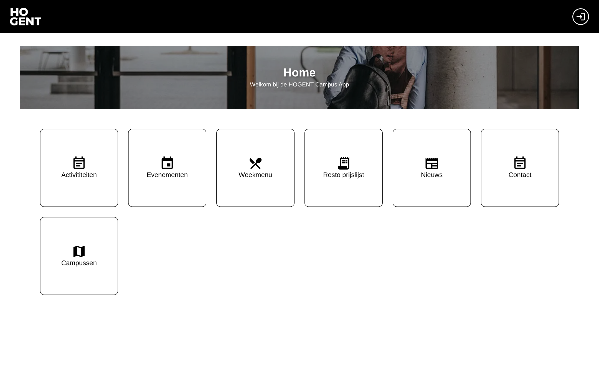 | 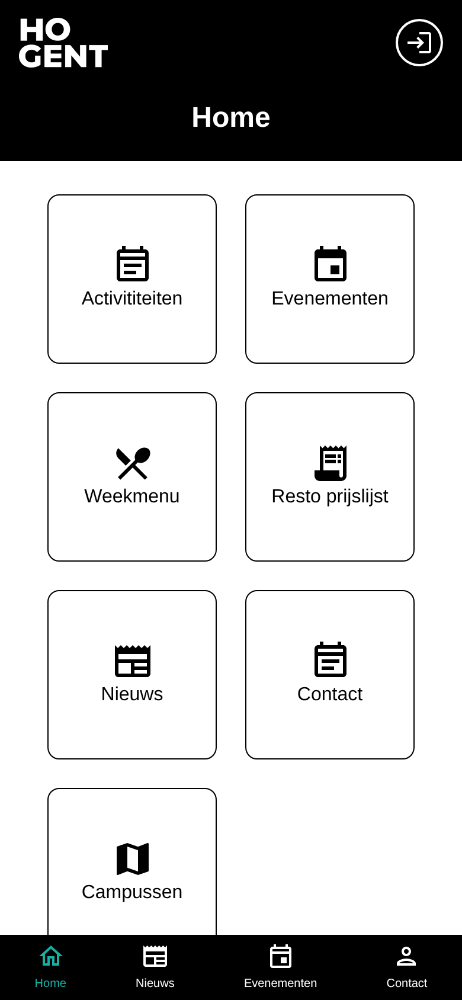 |
| *Desktop view with HOGENT banner and navigation modules* | *Responsive smartphone layout with bottom navigation bar* |

---

### 2. Student Activities & Community
Students can browse social gatherings, workshops, game nights, and networking events organized by student clubs. Each card displays date badges, start/end times, and campus locations.

| Student Activities Feed | Activity Detail View |
|:---:|:---:|
| 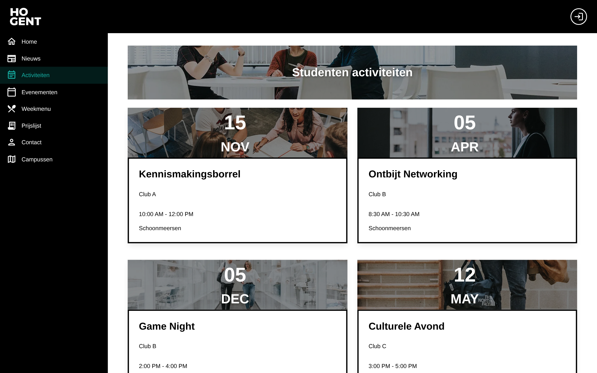 | 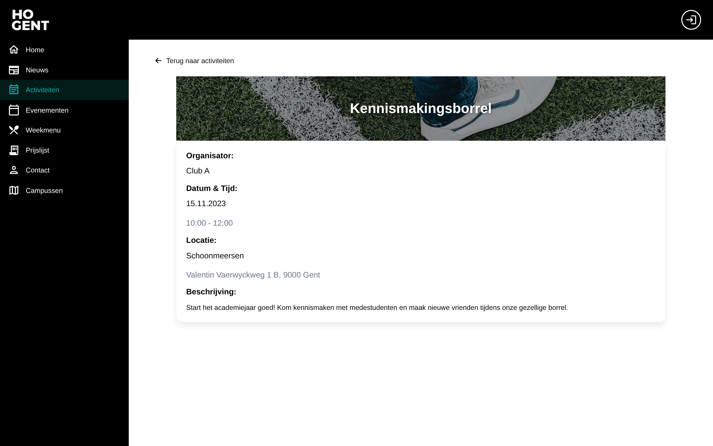 |
| *Browse upcoming student club activities with date and campus tags* | *Detailed view with organizer details, schedule, and venue address* |

---

### 3. School Events & Interactive Calendar
The events calendar features a day-by-day navigation timeline to discover academic conferences, guest lectures, theater nights, and student wellbeing sessions with direct registration.

| Campus Events Calendar | Event Details & Registration |
|:---:|:---:|
| 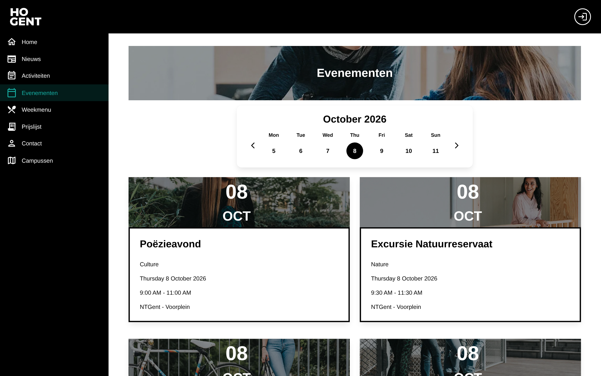 | 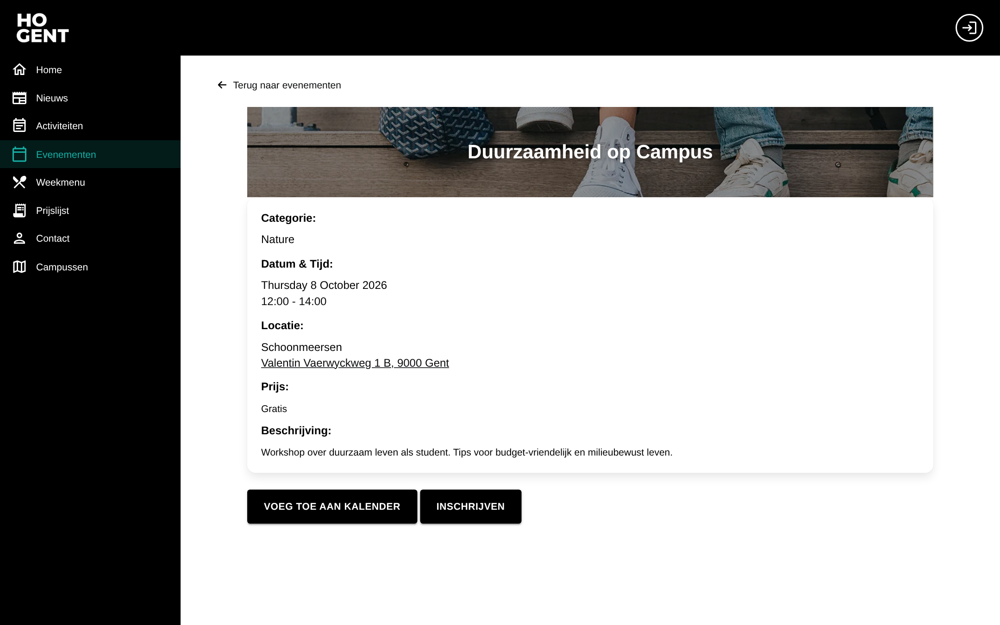 |
| *Weekly timeline view with categorized academic and campus events* | *Event details with pricing, location, calendar sync, and signup* |

---

### 4. Campus Restaurant: Weekly Menu & Price List
Stay up to date with daily cafeteria offerings. View fresh soups, hot meals, salads, and sandwiches with allergen indications, alongside full student and external visitor price lists.

| Rotating Weekly Menu | Itemized Price List |
|:---:|:---:|
| 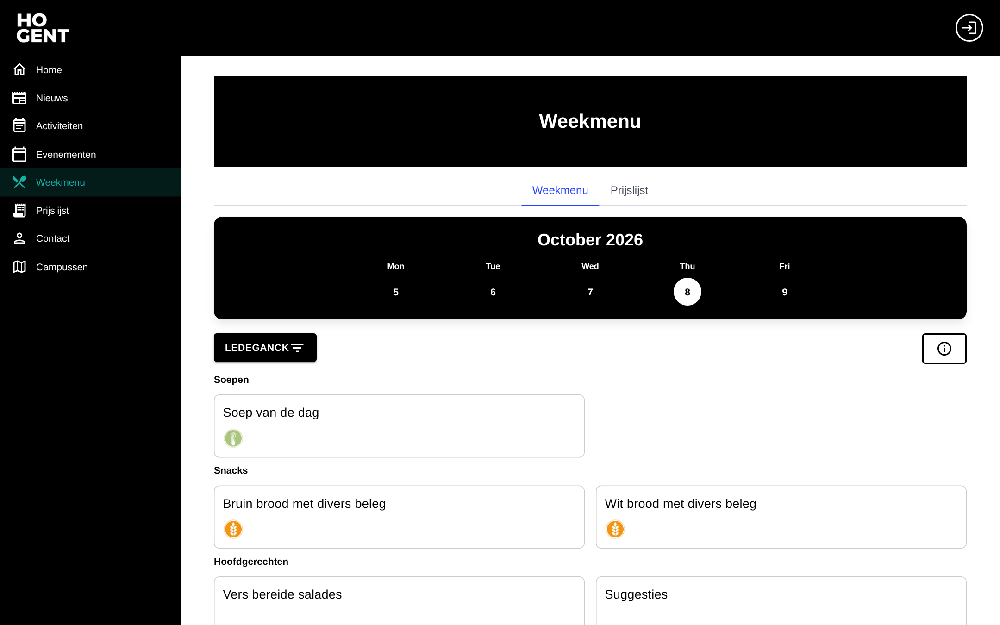 | 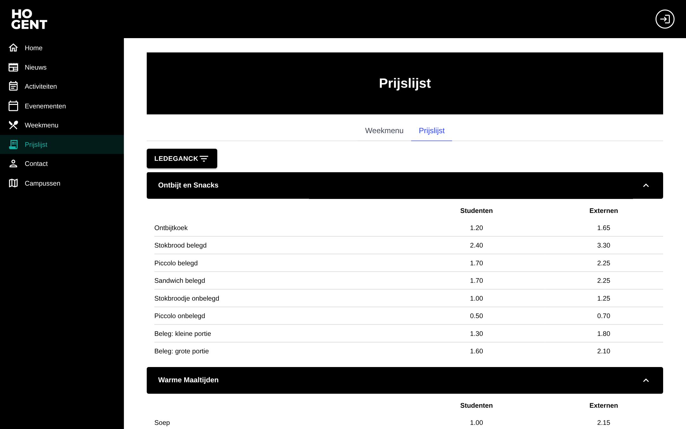 |
| *Daily menu items filtered by campus with allergen and dietary indicators* | *Expandable pricing categories comparing student and external rates* |

---

### 5. Campus News & Announcements
Stay informed with real-time university announcements, academic schedule releases, student union initiatives, and public transit alerts.

| News & Announcements Feed | Article Reader View |
|:---:|:---:|
| 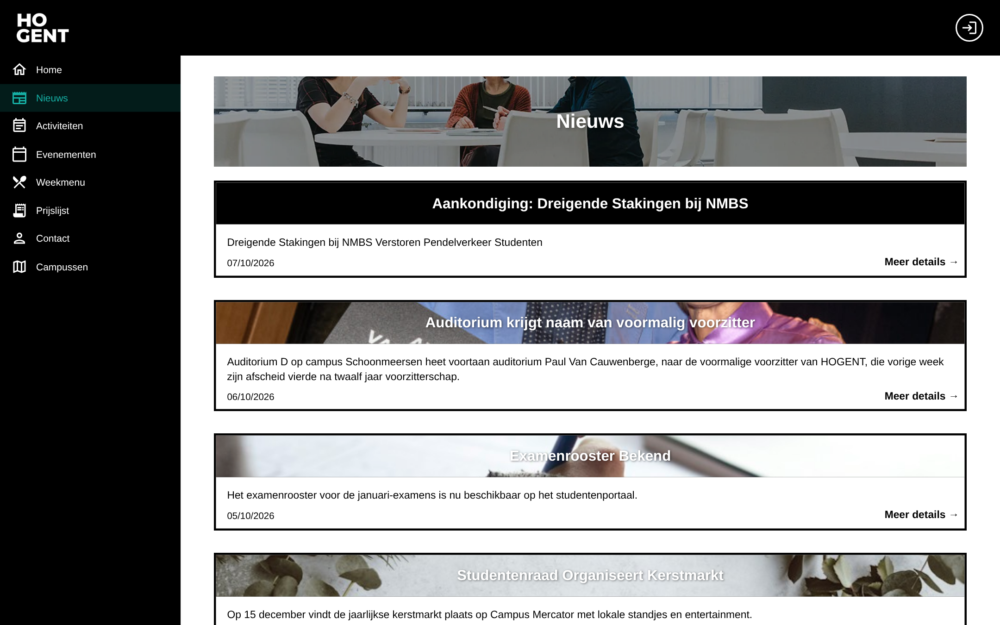 | 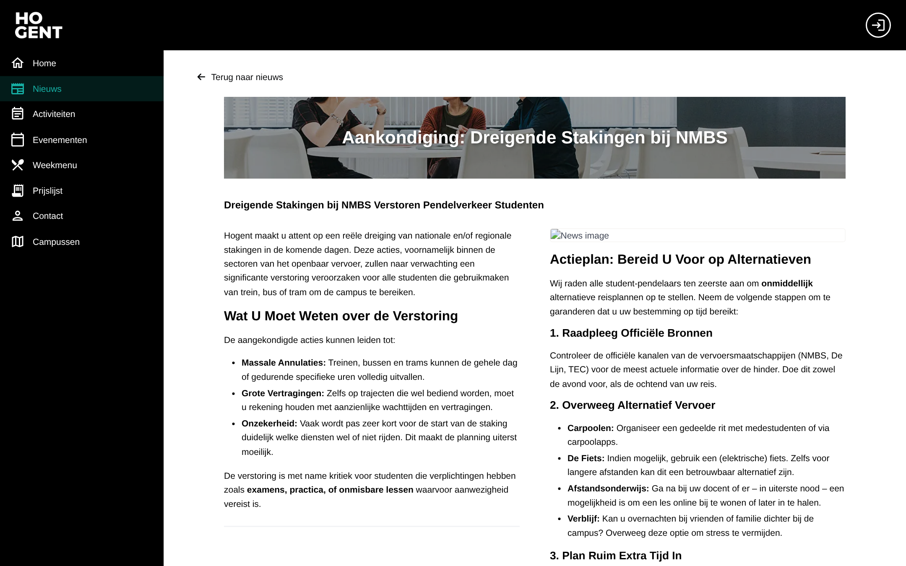 |
| *Curated campus news feed with featured photography and publication dates* | *Formatted article reader with recommendations and action plans* |

---

### 6. Campuses Directory & Interactive Floor Plans
Explore all 11 HOGENT campus sites. Each campus features detailed directions, parking regulations, Low Emission Zone (LEZ) notices, and high-resolution building maps.

| Multi-Campus Directory | Campus Schoonmeersen Detail & Map |
|:---:|:---:|
| 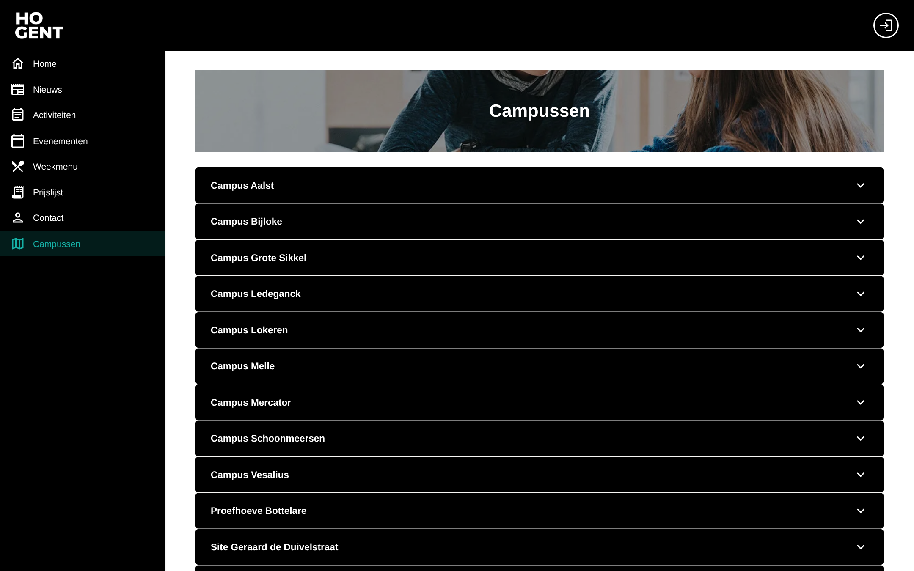 | 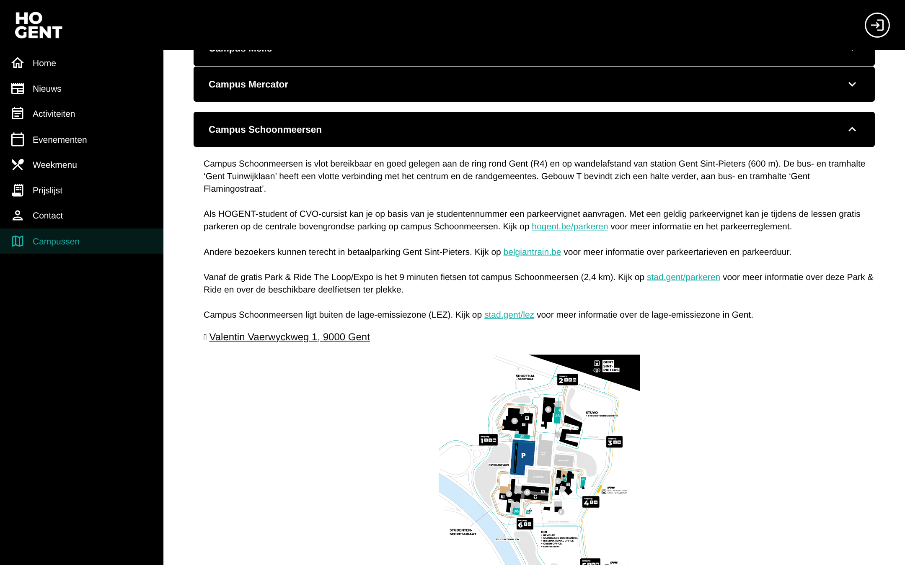 |
| *Collapsible guide for all 11 campus locations across Gent, Aalst, and Melle* | *In-depth site guide with public transit details, parking rules, and campus map* |

---

### 7. Contact & Student Support Services
Quickly find student administration desks, study coaches, and counseling facilities with live open/closed status indicators, opening hours, contact numbers, and campus filter dropdowns.

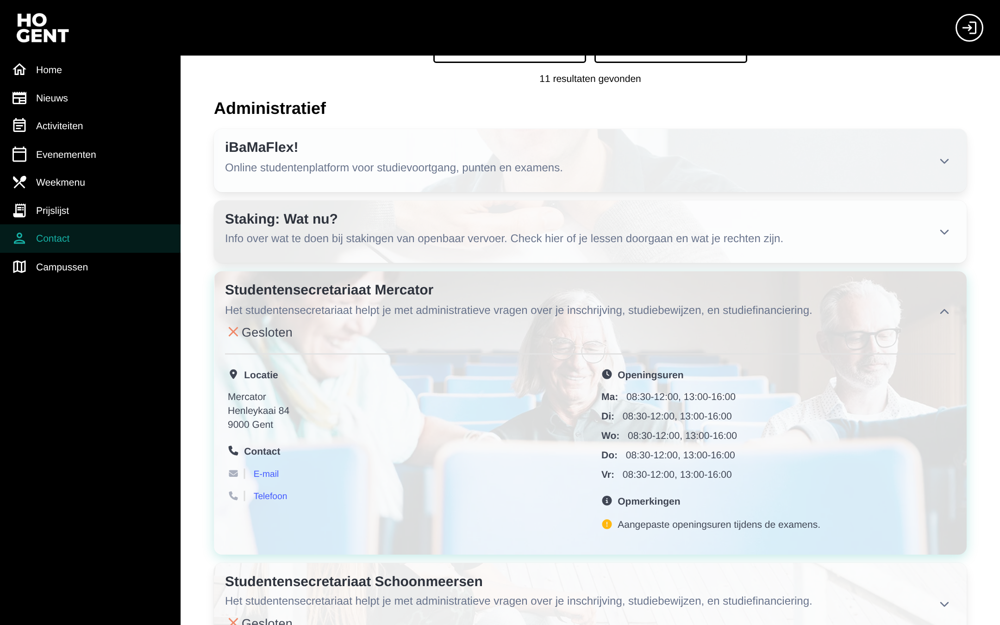
*Interactive student secretariat directory with real-time status and exam opening hours*

---

### 8. Design System & UI Component Library
RISE includes a documented Blazor UI component library built on MudBlazor, ensuring unified styling, accessibility, and consistency across all modules.

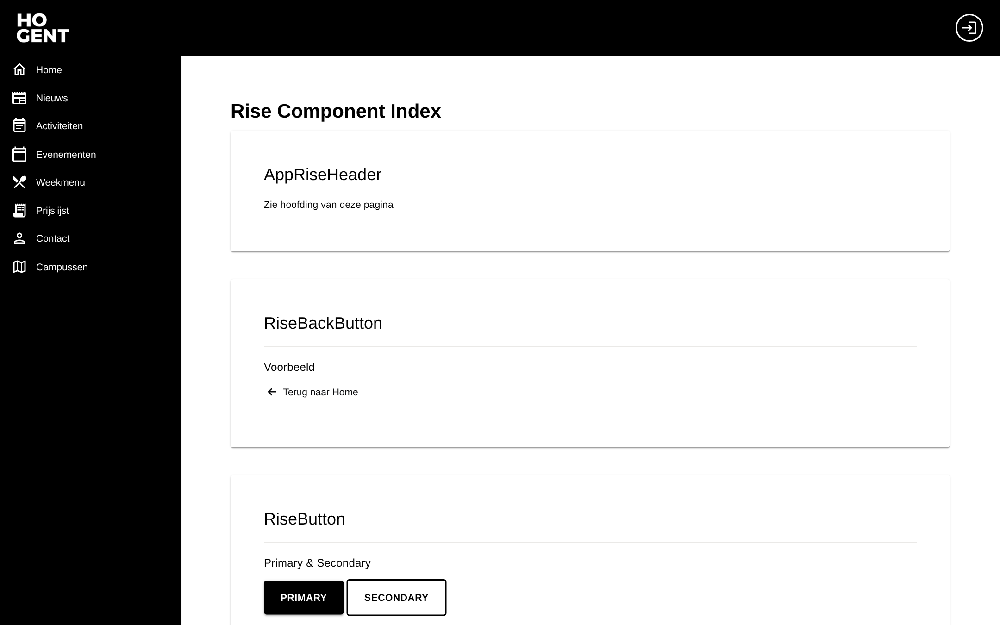
*Component showcase displaying design tokens, buttons, headers, and navigation elements*

---

## Software 
1. Install [Rider](https://www.jetbrains.com/rider/) or [Visual Studio](https://visualstudio.microsoft.com/)
2. Make sure you have [ASP.NET 9](https://dotnet.microsoft.com/en-us/download) installed (comes with Rider and Visual Studio) 

## Installation Instructions

1. Clone the repository

2. Open the `Rise.sln` file in [Rider](https://www.jetbrains.com/rider/), [Visual Studio](https://visualstudio.microsoft.com/) or  [Visual Studio Code](https://code.visualstudio.com/). (we prefer Rider, but you're free to choose.)

3. Run the project using the `Rise.Server` project as the startup project

4. The project should open in your default browser on port 5001.

5. The database (SQLite) will be created. However you will have to switch the database provider of your choosing 

   1. **SQL Server**

      Package: Microsoft.EntityFrameworkCore.SqlServer

      [NuGet Link](https://www.nuget.org/packages/Microsoft.EntityFrameworkCore.SqlServer/)

   2. **MariaDB**

      Package: Pomelo.EntityFrameworkCore.MySql

      [NuGet Link](https://www.nuget.org/packages/Pomelo.EntityFrameworkCore.MySql/)

   3. **PostgreSQL**

      Package: Npgsql.EntityFrameworkCore.PostgreSQL

      [NuGet Link](https://www.nuget.org/packages/Npgsql.EntityFrameworkCore.PostgreSQL/)

   4. Mongo etc... 

## Using Docker
To have a full environment, Docker is being used for 2 projects:
- Rise.Client
- Rise.Server

MariaDB is used instead of SQLite.

Go to https://www.docker.com/ for downloading Docker Desktop installation file.
Make sure docker desktop is up and running.
Go to solution path:

```
docker compose build --no-cache
```

```
docker compose up
```


## Creation of the database

Is done by the app itself using migrations. To add and remove migrations, install the dotnet ef tool globally by running the following command in your terminal (only do this once)

```
dotnet tool install --global dotnet-ef
```

## Migrations

Adapting the database schema can be done using migrations. To create a new migration, run the following command in the `src` folder

```
dotnet ef migrations add YourMigrationName --startup-project Rise.Server --project Rise.Persistence
```

And then update the database using the following command, or run the `Rise.Server`

```
dotnet ef database update --startup-project Rise.Server --project Rise.Persistence
```

## Usefull Commands

In the `src/Rise.Server` folder

`dotnet watch --non-interactive` 

The `dotnet watch` command is a file watcher. When it detects a change, it runs the `dotnet run` command or a specified `dotnet` command. If it runs `dotnet run`, and the change is supported for [hot reload](https://learn.microsoft.com/en-us/dotnet/core/tools/dotnet-watch#hot-reload), it hot reloads the specified application. If the change isn't supported, it restarts the application. This process enables fast iterative development from the command line.

`dotnet run`

The `dotnet run` command provides a convenient option to run your application from the source code with one command. It's useful for fast iterative development from the command line. The command depends on the [`dotnet build`](https://learn.microsoft.com/en-us/dotnet/core/tools/dotnet-build) command to build the code. Any requirements for the build apply to `dotnet run` as wel

`dotnet clean `- you won't need this often

The `dotnet clean` command cleans the output of the previous build. It's implemented as an [MSBuild target](https://learn.microsoft.com/en-us/visualstudio/msbuild/msbuild-targets), so the project is evaluated when the command is run. Only the outputs created during the build are cleaned. Both intermediate (*obj*) and final output (*bin*) folders are cleaned.

## Authentication

Authentication and authorization is handled by Microsoft Entra ID. 

- The **Blazor WASM** app handles **user login** via Microsoft Entra ID (OpenID Connect + PKCE).
- The **API** validates the **JWT access token** sent by Blazor.
- **No Client Secret** is required unless the API calls other services on its own (not applicable here).

### Users (development)

- regular@rise2526t2campusappoutlook.onmicrosoft.com (pw: Tako499281)

### Roles

There are 3 built-in roles, but adjust as needed

- Public (may be used for visuals)
- RegularStudent
- DistanceStudent

### Use cases

- GetInfo
- LoginCallback (after successful login in client)

### Requirements

- Microsoft Entra ID (Azure AD) tenant
- 2 App registrations (client + server)
- Access to [https://entra.microsoft.com](https://entra.microsoft.com)

### Setup Microsoft Entra ID

### 1. App registrations

#### A. FastEndpoints API (backend)

1. Go to **App registrations → New registration**
2. Name it e.g. `FastEndpointsAPI`
3. Type: "Accounts in this organizational directory only"
4. Click **Register**

#### Expose an API
1. Go to **Expose an API**
2. Set the **Application ID URI**, e.g.: api://<client-id>
3. Add a **scope**:
- **Scope name:** e.g. `user.read`
- **Who can consent:** Admins and users
- **Admin consent display name:** Access API
- **Admin consent description:** Allows access to FastEndpoints API
- Click **Add scope**
4. Go to **Manifest** and ensure `"accessTokenAcceptedVersion": 2` is set.

#### B. Blazor WASM (frontend)

1. Go to **Microsoft Entra ID → App registrations → New registration**
2. Name it e.g. `BlazorWasmClient`
3. Choose **"Accounts in this organizational directory only"**
4. Set the redirect URI:
    - `https://{base-url}/api/identity/accounts/login-callback`
      - replace {base-url} by the base url of your client
      - in development this will probably be localhost:5001, but port may be different
5. Click **Register**

#### Configure the app
- Note the **Application (Client) ID** and **Directory (Tenant) ID**
- Go to **Authentication**
    - Add a logout redirect URI:  
      `https://{base-url}/authentication/logout-callback`
      - replace {base-url} by the base url of your client
      - in development this will probably be localhost:5001, but port may be different
  - Enable *Allow public client flows (PKCE)*

#### Configure API access
1. Go to **API permissions**
2. Click **Add a permission → My APIs (or All API's) → [your API]**
3. Select the scope `user.read` (or your custom scope)
4. Click **Grant admin consent**

### 2. Project Configuration

#### A. FastEndpoints API
#### Add following items in `Program.cs`
````csharp
using Microsoft.Identity.Web;
using Microsoft.AspNetCore.Authentication.JwtBearer;

var builder = WebApplication.CreateBuilder(args);

builder.Services.AddAuthentication(JwtBearerDefaults.AuthenticationScheme)
    .AddMicrosoftIdentityWebApi(builder.Configuration.GetSection("AzureAd"));

builder.Services 
    ...
    .AddAuthorization()
    .AddCors(options =>
    {
        options.AddPolicy("FrontendPolicy", policy =>
        {
            var frontendUrl = builder.Configuration["FrontendUrl"];
            policy.WithOrigins(frontendUrl)
                  .AllowAnyMethod()
                  .AllowAnyHeader();
        });
    });

var app = builder.Build();

app
    ...
    .UseAuthentication()
    .UseAuthorization()
    ...
    .UseCors("FrontendPolicy");

app.Run();

````
#### Add following items in appsettings.json and replace props between brackets by values from settings in Microsoft Entra ID
````json
"FrontendUrl": "{frontend-url}",
"AzureAd": {
    "Instance": "https://login.microsoftonline.com/",
    "Domain": "{domain}.onmicrosoft.com",
    "ClientId": "{api-client-id}",
    "TenantId": "{tenant-id}",
    "Audience": "api://{api-client-id}"
}
````

#### B. Blazor WASM
Install package in Rise.Client:
````dotnet add package Microsoft.Authentication.WebAssembly.Msal````


Add to Rise.Client/Program.cs:
````csharp
    builder.Services.AddMsalAuthentication(options =>
    {
        builder.Configuration.Bind("AzureAd", options.ProviderOptions.Authentication);
        options.ProviderOptions.DefaultAccessTokenScopes.Add("api://8ae1a8dc-c2c6-44c9-bed8-7bbce3f84590/access_as_user");
        options.ProviderOptions.LoginMode = "redirect";
        options.ProviderOptions.Cache.CacheLocation = "localStorage"; 
    });
````    
Last option will make sure that your token is saved in localstorage, so that when you refresh a page you're still logged in. You can also change it with 'sessionStorage' or 'memory'.

Add to Rise.Client/appsettings.json
````json
  "AzureAd": {
    "Authority": "https://login.microsoftonline.com/052a5cbb-135d-45c5-b50e-689b56d29142",
    "ClientId": "dbcbd040-8ba4-4ed9-9004-fafff85674c7",
    "ValidateAuthority": true
  },
````

Add to Rise.Client/wwwroot/index.html
````html
    <script src="_content/Microsoft.Authentication.WebAssembly.Msal/AuthenticationService.js"></script>
    <script src="_framework/blazor.webassembly.js"></script>
````

